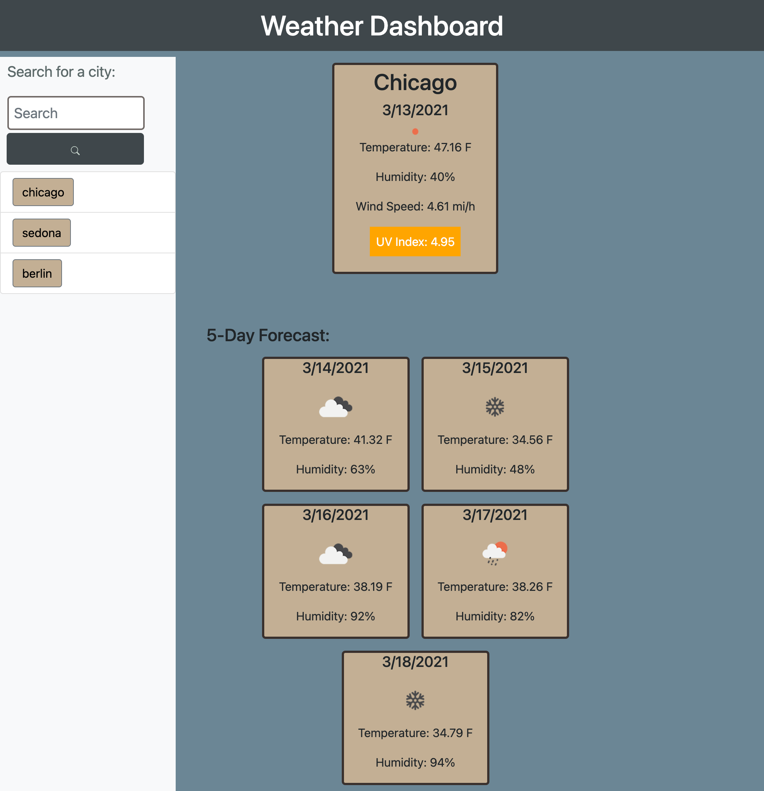

# weather-app

## What is the project?

This project is a weather forcasting app that lets user enter city name and displays current weather information and a 5 day forcast.

## What were the challenges?

It was pretty challenging defining all the individual pieces of data for the weather cards such as the wind speed, the uv lighting, etc. It was also challenging to modify the DOM a lot through JavaScript.

## What was updated?

This project was created from scratch so nothing was updated.

## Why did I decide to do this project?

I love riding my bike and playing sports outdoors but I really do not like the rain. I also have sensitive skin. This application will help me know what they weather and will also provide me with a UV indicator.

## What I learned in the process?

I learned so much more about how to manipulate the DOM, how to use server APIs and how to write functions in JavaScript.

## What makes this project stand out?

This is a good project that exemplifies the use of localStorage, server-side APIs, and all together HTML, CSS, and JS knowledge.

## Project Screenshot  

 
## Link to Deployed Project  

https://stevenstefanov.github.io/weather-app/
